# Google Cloud SecOps - Multi-Tier Foundations & Detection Engineering

[](README.md)
[](LICENSE)
[](SECURITY.md)

---
**Author:** Joabson Saccomani ([@jsaccomani](https://github.com/g-jsaccomani))
**Role:** Cloud Security Consultant
**LinkedIn:** [linkedin.com/in/jsaccomani](https://www.linkedin.com/in/jsaccomani)
*Copyright © 2026 Google LLC / Joabson Saccomani. All rights reserved. Distributed under the Apache License 2.0.*

---

## Overview

Centralized, production-grade repository for **Google Cloud SecOps & Security Command Center (SCC)** Foundations, multi-tier Terraform blueprints, detection engineering (YARA-L 2.0), CBN log parsers, and SOAR response playbooks.

This repository provides segregated **Tier Blueprints** with isolated Folders and Projects for:
1. **SCC Standard Tier** (Asset discovery, vulnerability scanning baseline, finding notifications).
2. **SCC Premium Tier** (Event Threat Detection, Container & VM Threat Detection, BigQuery Continuous Export, high/critical alerting pipelines).
3. **SCC Enterprise Tier** (Unified Google SecOps & Chronicle SIEM/SOAR convergence, hybrid/multi-cloud ingestion feeds, BigQuery Security Lake, automated playbook triggers).

---

## SecOps Multi-Tier Architecture

```mermaid
graph TD
    subgraph Organization["Google Cloud Organization / Parent"]
        FldrStd[" Folder: fldr-secops-standard"]
        FldrPrem[" Folder: fldr-secops-premium"]
        FldrEnt[" Folder: fldr-secops-enterprise"]
    end

    subgraph Standard["1. SCC Standard Tier"]
        FldrStd --> PrjStd["Project: prj-secops-std"]
        PrjStd --> StdAPIs["APIs: securitycenter, cloudasset, pubsub"]
        PrjStd --> StdTopic["Pub/Sub: top-scc-std-findings"]
        PrjStd --> StdBkt["GCS: bkt-secops-std-audit"]
    end

    subgraph Premium["2. SCC Premium Tier"]
        FldrPrem --> PrjPrem["Project: prj-secops-prem"]
        PrjPrem --> PremAPIs["APIs: ETD, CTD, VMTD, SHA, DLP, BQ"]
        PrjPrem --> PremBQ["BigQuery: ds_scc_premium_findings"]
        PrjPrem --> PremTopic["Pub/Sub Alerts + DLQ"]
        PrjPrem --> PremBkt["GCS: bkt-secops-prem-reports"]
    end

    subgraph Enterprise["3. SCC Enterprise & Chronicle"]
        FldrEnt --> PrjEnt["Project: prj-secops-ent"]
        PrjEnt --> EntAPIs["APIs: SecOps, Chronicle, SOAR, Lake"]
        PrjEnt --> EntLake["BigQuery Security Lake"]
        PrjEnt --> EntIngest["Pub/Sub Telemetry Ingestion"]
        PrjEnt --> EntSOAR["Pub/Sub SOAR Triggers"]
        PrjEnt --> EntBkt["GCS: bkt-secops-ent-ingestion"]
    end
```



---

## Repository Structure

```text
secops/
 tiers/
    scc-standard/               # Tier 1: Standard baseline foundation
       main.tf                 # Folder, project, standard APIs, Pub/Sub, GCS
       variables.tf
       outputs.tf
       terraform.tfvars.example
       deploy.sh
       destroy.sh
       README.md
    scc-premium/                # Tier 2: Threat detection & BigQuery export
       main.tf                 # ETD/CTD/VMTD/SHA, BigQuery dataset, DLQ alerting
       variables.tf
       outputs.tf
       terraform.tfvars.example
       deploy.sh
       destroy.sh
       README.md
    scc-enterprise/             # Tier 3: Unified SecOps & Chronicle SIEM/SOAR
        main.tf                 # SecOps Lake, Chronicle Ingestion, SOAR Triggers
        variables.tf
        outputs.tf
        terraform.tfvars.example
        deploy.sh
        destroy.sh
        README.md
 scripts/
    validate_env.sh             # Pre-flight environment & credentials check
    deploy_all.sh               # Sequential automated deployment of all tiers
    destroy_all.sh              # Teardown with safety confirmation guards
 dashboards/                     # SecOps dashboards and visualization templates
 docs/                           # Detection engineering standards and runbooks
 parsers/                        # CBN log parsing extensions and configurations
 playbooks/                      # SOAR workflow playbooks and automated response steps
 yara-l/                         # YARA-L 2.0 detection rules categorized by MITRE ATT&CK
 .gitignore
 CODE_OF_CONDUCT.md
 CONTRIBUTING.md
 LICENSE
 README.md
 SECURITY.md
```

---

## Quick Deployment Guide

### Prerequisites
- [Google Cloud SDK (`gcloud`)](https://cloud.google.com/sdk/docs/install)
- [Terraform](https://developer.hashicorp.com/terraform/downloads) (>= 1.5.0)
- IAM Roles on Parent Folder/Org: `roles/resourcemanager.folderAdmin`, `roles/resourcemanager.projectCreator`, `roles/billing.user`

### 1. Pre-flight Environment Validation
```bash
./scripts/validate_env.sh
```

### 2. Deploy Individual Tier
Navigate to the desired tier directory, configure `terraform.tfvars`, and run `deploy.sh`:

```bash
# Example: Deploy SCC Premium
cd tiers/scc-premium
cp terraform.tfvars.example terraform.tfvars
./deploy.sh
```

### 3. Deploy All Tiers Sequentially
```bash
./scripts/deploy_all.sh
```

---

## Tier Comparison Matrix

| Capability | Standard Tier | Premium Tier | Enterprise Tier |
| :--- | :---: | :---: | :---: |
| **Dedicated Folder + Project** | Yes | Yes | Yes |
| **Asset Discovery & Inventory** | Yes | Yes | Yes |
| **Basic Vulnerability Detection** | Yes | Yes | Yes |
| **Real-time Finding Pub/Sub** | Yes | Yes | Yes |
| **Security Health Analytics (SHA - CIS Benchmarks)** | Basic | Full (150+ rules) | Full (150+ rules) |
| **Event Threat Detection (ETD)** | No | Yes | Yes |
| **Container & VM Threat Detection (CTD/VMTD)** | No | Yes | Yes |
| **Sensitive Data Protection (Cloud DLP)** | No | Yes | Yes |
| **BigQuery Continuous Export** | No | Yes | Yes |
| **Dead-Letter Queue Alert Resilience** | No | Yes | Yes |
| **Google SecOps (Chronicle SIEM Ingestion)** | No | No | Yes |
| **SecOps SOAR Playbook Triggers** | No | No | Yes |
| **Enterprise BigQuery Security Lake** | No | No | Yes |
| **Multi-cloud / Hybrid Feeds** | No | No | Yes |

---

## License
This project is licensed under the Apache License, Version 2.0. See [LICENSE](LICENSE) for details.

<!-- Checkpoint: 2026-03-13 - docs(ruleset): document MITRE ATT&CK mapping for Chronicle detection rules -->

<!-- Checkpoint: 2026-04-07 - docs(ruleset): document MITRE ATT&CK mapping for Chronicle detection rules -->
