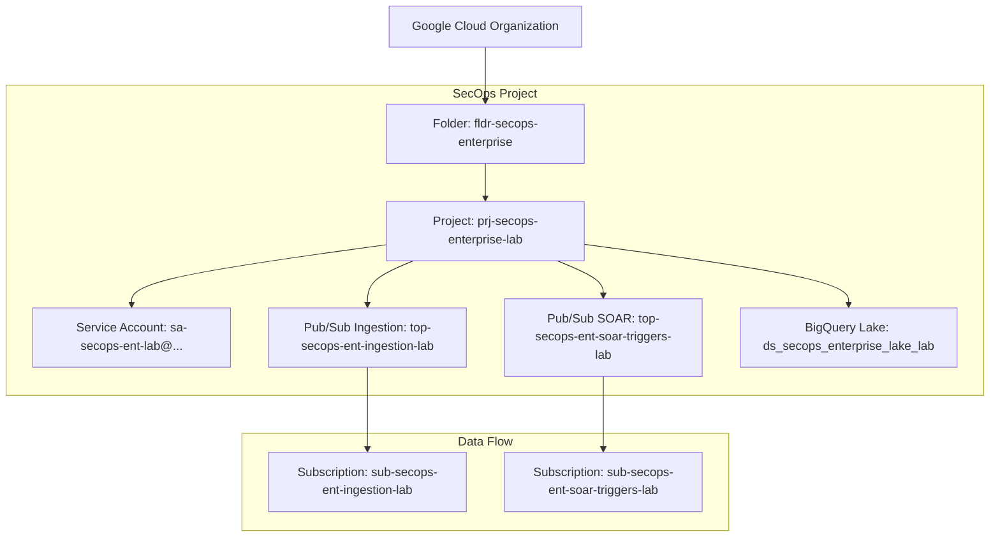

# Google Cloud SecOps Enterprise Lab Blueprint

**Workload:** Enterprise Cloud Security Operations & Threat Detection Lab
**Author:** Joabson Saccomani ([@jsaccomani](https://github.com/g-jsaccomani))
**Role:** Cloud Security Consultant
*Copyright © 2026 Google LLC / Joabson Saccomani. All rights reserved.*

---

## Objetivo do Laboratório

O **SecOps Enterprise Lab** foi projetado para simular, validar e implementar o ciclo de vida completo de operações de segurança moderna no **Google Cloud SecOps** (Chronicle SIEM, Chronicle SOAR e Security Command Center Enterprise), cobrindo:

1. **Infraestrutura e Identidade Segura**: Provisionamento de pastas, projetos, service accounts e permissões granulares de SIEM/SOAR.
2. **Ingestão e Normalização UDM**: Coleta multi-cloud de telemetria via Pub/Sub com mapeamento para o modelo UDM.
3. **Engenharia de Detecção (YARA-L 2.0)**: Regras analíticas de alta fidelidade para identidade, movimentação lateral e ataques à nuvem.
4. **Automação de Resposta a Incidentes (SOAR)**: Playbooks com IA assistida (Gemini SecOps Assistant) para contenção automática.

---

## Topologia Arquitetural

---

## Recursos e Parâmetros de Referência

| Recurso | ID / Identificador Padrão | Descrição |
| :--- | :--- | :--- |
| **Projeto Lab** | `prj-secops-enterprise-lab` | Projeto central isolado para as operações de SecOps |
| **Folder Pai** | `folders/123456789012` | Pasta organizacional (`fldr-secops-enterprise`) |
| **Região Principal** | `us-central1` | Localização primária dos recursos analíticos |
| **Pub/Sub Ingestion** | `top-secops-ent-ingestion-lab` | Tópico de alta taxa para ingestão de telemetria multi-cloud |
| **Pub/Sub SOAR Triggers** | `top-secops-ent-soar-triggers-lab` | Pipeline de baixa latência para disparo de playbooks de resposta |
| **BigQuery Security Lake** | `ds_secops_enterprise_lake_lab` | Dataset analítico para consultas UDM, auditoria e dashboards |
| **Service Account** | `sa-secops-ent-lab@prj-secops-enterprise-lab.iam.gserviceaccount.com` | Conta de serviço operacional com papéis de SecOps, Pub/Sub e BigQuery |
