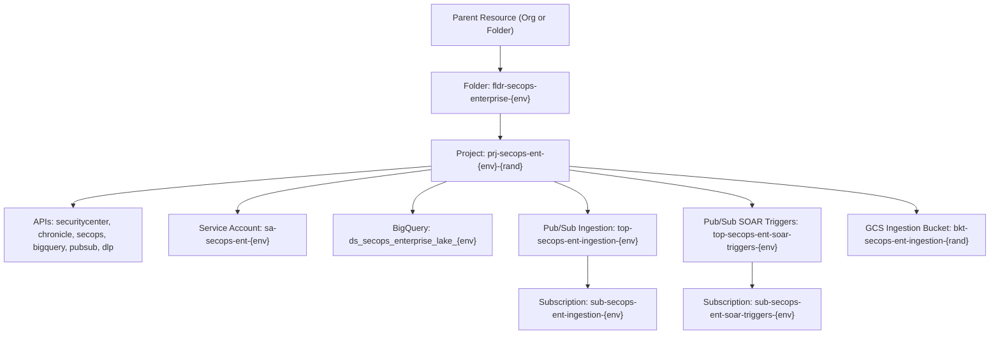

# Google Cloud SecOps - SCC Enterprise Tier Foundation

This module provisions the **Security Command Center (SCC) Enterprise Tier & Google SecOps (Chronicle SIEM & SOAR) Foundation**, establishing a unified cross-cloud security operations baseline, automated telemetry ingestion pipelines, BigQuery Security Lake, and real-time SOAR playbook trigger infrastructure.

---

## Architecture Overview



---

## Provisioned Resources

| Resource | Type | Purpose |
| :--- | :--- | :--- |
| **SecOps Enterprise Folder** | `google_folder` | Dedicated organizational folder for Enterprise SecOps governance |
| **SecOps Enterprise Project** | `google_project` | Project container for Chronicle SIEM & SOAR unified operations |
| **Unified SecOps APIs** | `google_project_service` | Enables Security Center, Chronicle, SecOps, BigQuery, DLP, Pub/Sub |
| **Orchestration SA** | `google_service_account` | High-privilege service account for SOAR automation and feed ingestion |
| **Enterprise Security Lake** | `google_bigquery_dataset` | Enterprise Data Lake for multi-cloud telemetry, compliance, and custom detection |
| **Ingestion Pipeline** | `google_pubsub_topic` | High-throughput telemetry ingestion topic and subscription |
| **SOAR Trigger Pipeline** | `google_pubsub_topic` | Dedicated low-latency trigger pipeline for automated incident response playbooks |
| **Ingestion Bucket** | `google_storage_bucket` | Encrypted GCS bucket for log feeds, evidence, and raw artifacts |

---

## Quick Start

### 1. Configuration
Copy the template and adjust your organization/billing variables:
```bash
cp terraform.tfvars.example terraform.tfvars
```

### 2. Deploy
Run the automated deployment script:
```bash
chmod +x deploy.sh
./deploy.sh
```

### 3. Teardown
To safely remove all created resources:
```bash
chmod +x destroy.sh
./destroy.sh
```

<!-- Checkpoint: 2026-05-07 - docs(ruleset): document MITRE ATT&CK mapping for Chronicle detection rules -->
