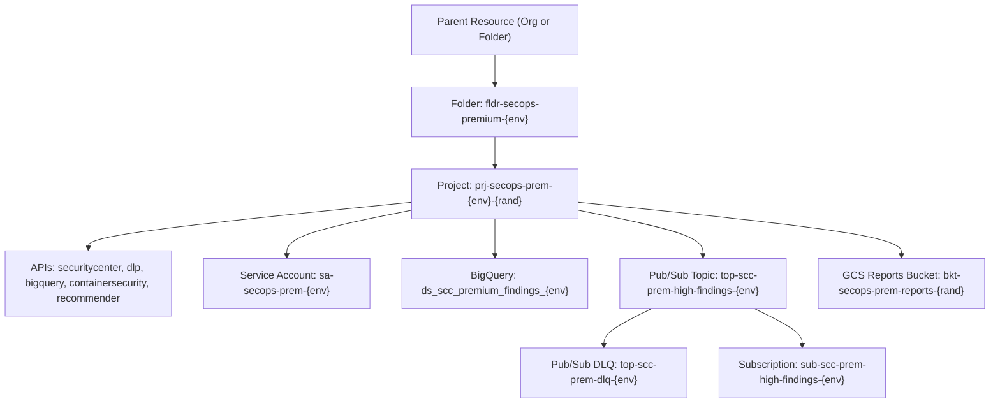

# Google Cloud SecOps - SCC Premium Tier Foundation

This module provisions the **Security Command Center (SCC) Premium Tier Foundation**, setting up a dedicated administrative folder and project, advanced threat detection APIs (Event Threat Detection, Container Threat Detection, VM Threat Detection), continuous BigQuery finding exports, and dead-letter queue backed Pub/Sub alert streaming.

---

## Architecture Overview



---

## Provisioned Resources

| Resource | Type | Purpose |
| :--- | :--- | :--- |
| **SecOps Premium Folder** | `google_folder` | Dedicated organizational folder for SCC Premium isolation |
| **SecOps Premium Project** | `google_project` | Project container for advanced threat analytics and posture management |
| **Advanced Threat APIs** | `google_project_service` | Enables ETD, CTD, VMTD, SHA, Cloud DLP, CIEM & BigQuery |
| **Automation SA** | `google_service_account` | High-privilege SecOps automation service account |
| **BigQuery Dataset** | `google_bigquery_dataset` | Data warehouse destination for continuous findings export and historical analysis |
| **Alert Topic & DLQ** | `google_pubsub_topic` | Real-time notification pipeline with dead-letter queue resilience |
| **Posture Bucket** | `google_storage_bucket` | Encrypted GCS bucket for compliance and posture snapshots |

---

## Quick Start

### 1. Configuration
Copy the template and adjust your organization/billing variables:
```bash
cp terraform.tfvars.example terraform.tfvars
```

### 2. Deploy
Run the automated deployment script:
```bash
chmod +x deploy.sh
./deploy.sh
```

### 3. Teardown
To safely remove all created resources:
```bash
chmod +x destroy.sh
./destroy.sh
```

<!-- Checkpoint: 2026-05-27 - docs(ruleset): document MITRE ATT&CK mapping for Chronicle detection rules -->

<!-- Checkpoint: 2026-06-16 - poc(soar-playbook): build automated containment playbook for compromised user account -->
