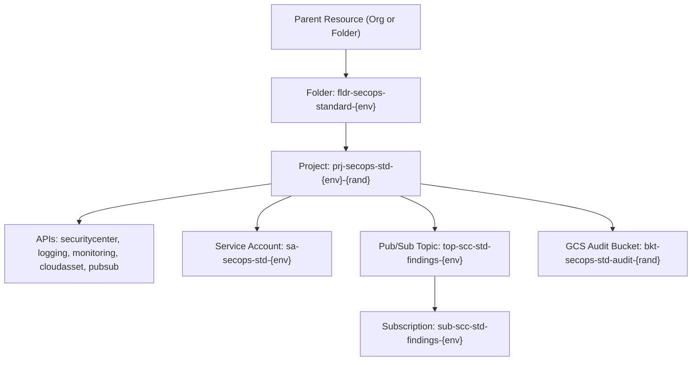

# Google Cloud SecOps - SCC Standard Tier Foundation

This module provisions the **Security Command Center (SCC) Standard Tier Foundation**, setting up a dedicated administrative folder and project, foundational security APIs, Pub/Sub notifications, and secure GCS audit storage.

---

## Architecture Overview



---

## Provisioned Resources

| Resource | Type | Purpose |
| :--- | :--- | :--- |
| **SecOps Standard Folder** | `google_folder` | Dedicated organizational folder for SCC Standard workload isolation |
| **SecOps Standard Project** | `google_project` | Project container for standard security operations and finding ingestion |
| **Foundational APIs** | `google_project_service` | Enables Security Center, Cloud Asset, Cloud Logging, Monitoring & Pub/Sub |
| **Automation SA** | `google_service_account` | Least-privilege IAM service account for operational automation |
| **Findings Topic & Sub** | `google_pubsub_topic` | Pub/Sub pipeline for real-time finding notifications |
| **Audit Bucket** | `google_storage_bucket` | Encrypted GCS bucket with uniform access and 90-day lifecycle |

---

## Quick Start

### 1. Configuration
Copy the template and adjust your organization/billing variables:
```bash
cp terraform.tfvars.example terraform.tfvars
```

### 2. Deploy
Run the automated deployment script:
```bash
chmod +x deploy.sh
./deploy.sh
```

### 3. Teardown
To safely remove all created resources:
```bash
chmod +x destroy.sh
./destroy.sh
```

<!-- Checkpoint: 2026-03-27 - poc(soar-playbook): build automated containment playbook for compromised user account -->
